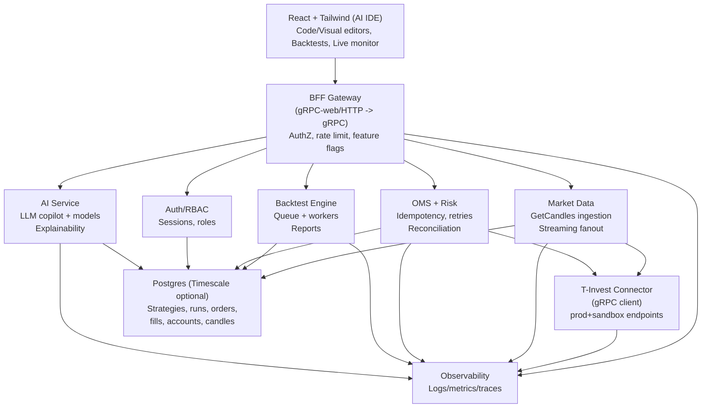
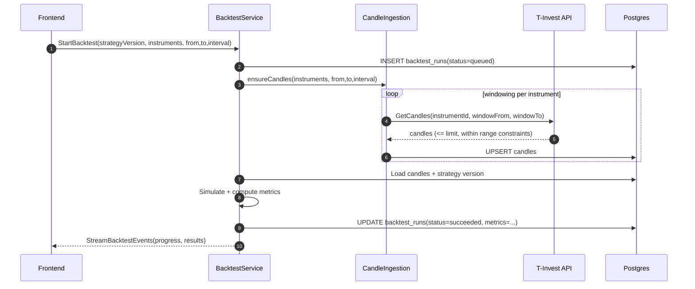
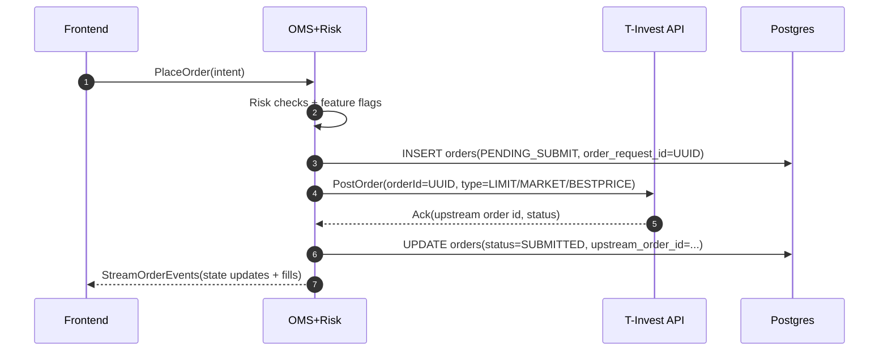

# AI‑First Trading IDE Web App for T‑Invest API — Actionable Engineering Brief

## Executive summary

Build a web‑based AI trading IDE that lets users author TypeScript strategies, backtest them on historical candles, and execute them live against the T‑Invest API via a secure gRPC Node.js backend. Keep all broker tokens server‑side; the frontend only talks to your backend over authenticated gRPC‑web/HTTP. Implement in phases: (1) accounts + historical candles + strategy authoring + backtest MVP, (2) live OMS + streaming + reconciliation, (3) AI assistant + model training/inference + explainability + guarded rollout. Use `.env` only for local dev; for production, move secrets to a secret manager and enforce RBAC, audit trails, and observability from day one.

## Scope, requirements, and assumptions

### Functional requirements

**Core IDE**
- Strategy workspace: create/edit/version strategies in **TypeScript** (and optionally a JSON DSL that compiles to TS).
- Templates: starter strategies (MA crossover, breakout, mean reversion, momentum, pairs).
- Backtest runner: configure instruments, date range, candle interval, fees/slippage model; produce metrics and reports.

**Broker connectivity to T‑Invest**
- Support both environments:
  - **Production** gRPC endpoint `invest-public-api.tbank.ru:443`
  - **Sandbox** gRPC endpoint `sandbox-invest-public-api.tbank.ru:443` citeturn0search4
- Optional protocol support (debug tooling):
  - REST proxy endpoints exist (`https://invest-public-api.tbank.ru/rest/`, sandbox variant). citeturn0search4
  - WebSocket JSON proxy for gRPC streaming exists; token can be sent via `Authorization: Bearer …` or `Web-Socket-Protocol: json, <token>` and must specify JSON protocol. citeturn0search19turn0search3

**Market data**
- Historical candles via `GetCandles` (windowed ingestion + caching).
- Real‑time streaming for candles/order book/trades/last price (phase 2+).

**Trading execution**
- OMS supports order placement/cancel/replace + streaming order state + fills.
- Support T‑Invest order types: LIMIT / MARKET / BESTPRICE. citeturn0search2
- Enforce idempotent order submission using required `orderId` (max 36 chars) as idempotency key. citeturn0search2
- Replace order uses a new `idempotencyKey` (max 36) and overwrites the old key. citeturn0search6

**AI‑first features**
- LLM “copilot” for strategy creation/editing, parameter suggestions, backtest interpretation, and risk warnings.
- Optional predictive models (ranking, classification, regression) trained on candles/features.
- Explainability view (feature attributions, signal reasoning, safety gates).

### Non‑functional requirements

- **Security**: tokens never reach the browser; encryption at rest; least privilege; RBAC; immutable audit trail.
- **Reliability**: safe retries only with idempotency keys; stream reconnect; reconciliation to correct drift.
- **Performance** (targets are **unspecified**, define before Phase 2):
  - throughput (#users, #instruments, #stream subs), latency goals, data retention, region.
- **Maintainability**: strict TypeScript, contract‑first gRPC protos, CI checks, code review gates.
- **Observability**: structured logs + metrics + traces; alerting for stream drops, order rejects, backtest queue time.

### Unspecified details (must be decided early)
- Account types and trading permissions (some accounts may not allow orders).
- Expected scale (users, instruments, concurrent backtests, streaming subscriptions).
- Hosting region, data retention requirements, compliance boundaries.

## System architecture and gRPC API contracts

### Architecture approach

Start as a **modular monolith** (single Node.js process with module boundaries) for Phase 1, then split into services once you have real load and clear boundaries. Recommended module/service boundaries:

- **Gateway/BFF** (gRPC‑web + auth middleware)
- **Auth/RBAC**
- **T‑Invest connector** (gRPC client; prod/sandbox switch)
- **Market Data** (ingestion, caching, stream fanout)
- **Backtest** (job queue, simulation engine, reporting)
- **OMS + Risk** (orders, idempotency, retries, reconciliation)
- **AI** (LLM copilot + model training/inference)
- **Storage** (Postgres/Timescale connectors)

T‑Invest is a gRPC API and supports bidirectional streaming, which aligns well with a gRPC backend design. citeturn0search0turn0search8

### Mermaid architecture diagram



### Key internal gRPC proto snippets (examples)

These are **your** internal contracts (not T‑Invest’s), designed to make the frontend independent of broker specifics and to keep tokens server‑side.

```proto
syntax = "proto3";
package aiide.v1;

import "google/protobuf/timestamp.proto";
import "google/protobuf/empty.proto";

enum Env {
  ENV_UNSPECIFIED = 0;
  ENV_SANDBOX = 1;
  ENV_PROD = 2;
}

service AuthService {
  rpc CreateSession(CreateSessionRequest) returns (Session);
  rpc GetSession(google.protobuf.Empty) returns (Session);
  rpc Logout(google.protobuf.Empty) returns (google.protobuf.Empty);
}

message CreateSessionRequest {
  string email = 1;
  string password = 2; // or OIDC token (unspecified)
}

message Session {
  string session_id = 1;
  string user_id = 2;
  google.protobuf.Timestamp expires_at = 3;
}

service BrokerService {
  rpc ListAccounts(ListAccountsRequest) returns (ListAccountsResponse);
  rpc GetPortfolio(GetPortfolioRequest) returns (PortfolioSnapshot);

  rpc GetCandles(GetCandlesRequest) returns (CandlesResponse);
  rpc StreamMarketData(stream MarketDataSub) returns (stream MarketDataEvent);

  rpc PlaceOrder(PlaceOrderRequest) returns (OrderAck);
  rpc CancelOrder(CancelOrderRequest) returns (google.protobuf.Empty);
  rpc ReplaceOrder(ReplaceOrderRequest) returns (OrderAck);
  rpc StreamOrderEvents(StreamOrderEventsRequest) returns (stream OrderEvent);
}

message ListAccountsRequest { Env env = 1; }
message ListAccountsResponse { repeated BrokerAccount accounts = 1; }

message BrokerAccount {
  string broker_account_id = 1; // internal UUID
  string upstream_account_id = 2; // T-Invest accountId
  Env env = 3;
  bool trading_enabled = 4;
}

message GetPortfolioRequest {
  string broker_account_id = 1;
  string currency = 2; // "RUB"/"USD"/"EUR"
}
message PortfolioSnapshot { /* positions + cash summary */ }

message GetCandlesRequest {
  string instrument_id = 1; // prefer instrument UID (unspecified)
  string interval = 2;      // "1m","5m","1h","1d"
  google.protobuf.Timestamp from = 3;
  google.protobuf.Timestamp to = 4;
}
message Candle {
  google.protobuf.Timestamp ts = 1;
  double open = 2;
  double high = 3;
  double low = 4;
  double close = 5;
  double volume = 6;
}
message CandlesResponse { repeated Candle candles = 1; }

message MarketDataSub {
  oneof sub {
    CandleSub candles = 1;
    OrderBookSub orderbook = 2;
    TradesSub trades = 3;
    LastPriceSub last_price = 4;
  }
}
message CandleSub { repeated string instrument_ids = 1; string interval = 2; bool waiting_close = 3; }
message OrderBookSub { repeated string instrument_ids = 1; int32 depth = 2; }
message TradesSub { repeated string instrument_ids = 1; }
message LastPriceSub { repeated string instrument_ids = 1; }

message MarketDataEvent { /* typed union */ }

enum Side { SIDE_UNSPECIFIED = 0; SIDE_BUY = 1; SIDE_SELL = 2; }
enum OrderType { OT_UNSPECIFIED = 0; OT_LIMIT = 1; OT_MARKET = 2; OT_BESTPRICE = 3; }

message PlaceOrderRequest {
  string broker_account_id = 1;
  string instrument_id = 2;
  Side side = 3;
  OrderType order_type = 4;
  int64 lots = 5;
  double limit_price = 6;     // for limit
  string idempotency_key = 7; // UUID <= 36 chars
}
message CancelOrderRequest { string broker_account_id = 1; string order_id = 2; }
message ReplaceOrderRequest {
  string broker_account_id = 1;
  string exchange_order_id = 2; // upstream order id
  string idempotency_key = 3;   // new key <= 36 chars
  int64 lots = 4;
  double limit_price = 5;
}
message OrderAck { string internal_order_id = 1; string status = 2; string upstream_order_id = 3; }
message StreamOrderEventsRequest { string broker_account_id = 1; }
message OrderEvent { /* state updates + fills */ }

service BacktestService {
  rpc StartBacktest(StartBacktestRequest) returns (BacktestJob);
  rpc GetBacktest(BacktestRef) returns (BacktestJob);
  rpc StreamBacktestEvents(BacktestRef) returns (stream BacktestEvent);
}

message StartBacktestRequest {
  string strategy_version_id = 1;
  repeated string instrument_ids = 2;
  google.protobuf.Timestamp from = 3;
  google.protobuf.Timestamp to = 4;
  string candle_interval = 5;
  FeesModel fees = 6;
  SlippageModel slippage = 7;
}

message FeesModel { string model = 1; double bps = 2; }
message SlippageModel { string model = 1; double bps = 2; }

message BacktestRef { string backtest_id = 1; }
message BacktestJob { string backtest_id = 1; string status = 2; double progress = 3; }
message BacktestEvent { string kind = 1; string message = 2; google.protobuf.Timestamp ts = 3; }

service AIService {
  rpc Chat(AIChatRequest) returns (AIChatResponse);
  rpc SuggestStrategy(AIStrategyRequest) returns (AIStrategyResponse);
  rpc ExplainBacktest(AIExplainRequest) returns (AIExplainResponse);
}

message AIChatRequest { string workspace_id = 1; repeated AIMessage messages = 2; }
message AIMessage { string role = 1; string content = 2; }

message AIChatResponse { string assistant_message = 1; repeated string citations = 2; }

message AIStrategyRequest {
  string template = 1;
  string constraints = 2; // risk limits, instruments, etc
}
message AIStrategyResponse {
  string typescript_code = 1;
  map<string,string> recommended_params = 2;
  string safety_notes = 3;
}

message AIExplainRequest { string backtest_id = 1; }
message AIExplainResponse { string summary = 1; string risks = 2; }
```

Implementation note: map internal `OrderType` to T‑Invest `ORDER_TYPE_LIMIT | ORDER_TYPE_MARKET | ORDER_TYPE_BESTPRICE`. citeturn0search2

## Data model, ingestion/windowing, and backtesting design

### Postgres schema summary (tables you must have)

| Table | Purpose | Keys | Notes |
|---|---|---|---|
| `users`, `sessions`, `roles`, `user_roles` | Auth/RBAC | `users.id`, `sessions.id` | Prefer OIDC later; keep session layer now |
| `broker_accounts` | T‑Invest account bindings (prod/sandbox) | `(user_id, env, account_id)` unique | Account types/permissions are **unspecified** |
| `strategies`, `strategy_versions` | IDE artifacts + versioned code | `(strategy_id, version)` unique | Store TS source + params + risk config |
| `candles` | Cached candles for speed/backtests | `(instrument_id, interval, ts)` | Use Timescale hypertables optionally |
| `backtest_runs` | Backtest jobs + metrics | `id` | Store models used (fees/slippage) |
| `live_runs` | Running strategy instances | `id` | Heartbeats + risk state |
| `orders`, `fills` | OMS core | `orders.id`, `fills.id` | `order_request_id` idempotency key |
| `audit_events` | Immutable audit log | `id` | Store request ids, state transitions |

### DDL snippets (minimal viable)

```sql
create table broker_accounts (
  id uuid primary key,
  user_id uuid not null,
  env text not null check (env in ('sandbox','prod')),
  account_id text not null,                -- T-Invest accountId
  display_name text,
  trading_enabled boolean,
  created_at timestamptz not null default now(),
  unique(user_id, env, account_id)
);

create table strategies (
  id uuid primary key,
  user_id uuid not null,
  name text not null,
  created_at timestamptz not null default now()
);

create table strategy_versions (
  id uuid primary key,
  strategy_id uuid not null references strategies(id),
  version int not null,
  language text not null default 'typescript',
  code text not null,
  params jsonb not null default '{}'::jsonb,
  risk_config jsonb not null default '{}'::jsonb,
  created_at timestamptz not null default now(),
  unique(strategy_id, version)
);

create table candles (
  instrument_id text not null,
  interval text not null,                  -- "1m","5m","1h","1d"
  ts timestamptz not null,
  open numeric not null,
  high numeric not null,
  low numeric not null,
  close numeric not null,
  volume numeric,
  primary key (instrument_id, interval, ts)
);

create table backtest_runs (
  id uuid primary key,
  strategy_version_id uuid not null references strategy_versions(id),
  status text not null,                    -- queued/running/succeeded/failed
  from_ts timestamptz not null,
  to_ts timestamptz not null,
  candle_interval text not null,
  instruments text[] not null,
  fees_model jsonb not null,
  slippage_model jsonb not null,
  metrics jsonb,
  error text,
  created_at timestamptz not null default now()
);

create table orders (
  id uuid primary key,
  live_run_id uuid,
  env text not null check (env in ('sandbox','prod')),
  account_id text not null,
  instrument_id text not null,
  side text not null check (side in ('BUY','SELL')),
  order_type text not null check (order_type in ('LIMIT','MARKET','BESTPRICE')),
  lots bigint not null,
  limit_price numeric,
  order_request_id text not null,          -- idempotency key <= 36
  upstream_order_id text,
  status text not null,
  created_at timestamptz not null default now(),
  updated_at timestamptz not null default now(),
  unique(env, account_id, order_request_id)
);

create table fills (
  id uuid primary key,
  order_id uuid not null references orders(id),
  upstream_trade_id text,
  price numeric not null,
  lots bigint not null,
  executed_at timestamptz not null
);
```

### Historical data ingestion and windowing (GetCandles constraints)

Design ingestion to obey documented range/limit constraints. `GetCandles` specifies max ranges per interval and max `limit` (examples: 1‑minute candles “up to 1 day”, hour “up to 3 months”, day “up to 6 years”, and max `limit` 2400). citeturn0search1

**Implementation tasks**
- Build `CandleIngestionService.ensureCandles(instrumentId, interval, from, to)`:
  - Determine window size by interval per doc constraints.
  - Loop: request `[windowFrom, windowTo]`, upsert to `candles`.
  - Track gaps; log metrics (#calls, rows, lag).
- Cache reads for backtests:
  - If data exists locally for requested windows → use DB.
  - Else backfill missing windows → then run backtest.
- Timescale optional:
  - If used, convert `candles` to hypertable and compress older partitions (retention policy is **unspecified**).

### Backtesting engine design (accuracy, slippage/fees, speed)

**MVP design (phase 1)**
- Event‑driven candle replay simulation:
  - At each candle close (or open), compute indicators/features.
  - Generate desired position/order intents.
  - Simulate fills with a simple execution model:
    - fees: constant bps (configurable)
    - slippage: constant bps or spread‑proxy (if you have order book later)
- Determinism: strategy version + params + dataset snapshot hash ⇒ reproducible run id.

**Accuracy upgrades (phase 3)**
- Add intrabar simulation options (if you ingest smaller intervals).
- Use order book snapshots for slippage modeling (if you subscribe/ingest them).
- Add partial fills and latency simulation (latency targets are **unspecified**).

**Speed**
- Run backtests in worker threads (Node `worker_threads`) or a separate “backtest worker” service.
- Batch DB reads: pull candle ranges in chunks; avoid per‑candle queries.

### Backtest sequence flow (mermaid)



## Live execution, streaming, security, and delivery plan

### Real‑time streaming options

- Preferred: backend uses T‑Invest gRPC streaming (stable for server‑to‑server).
- Alternative/debug: JSON WebSocket proxy exists; connect to `wss://invest-public-api.tbank.ru/ws/`, pass token in headers as documented, specify JSON protocol. citeturn0search19turn0search3  
Choose one in Phase 2; do not implement both until necessary.

### OMS/execution design (idempotency, retries, order types)

**Order types and idempotency requirements**
- Must support `ORDER_TYPE_LIMIT`, `ORDER_TYPE_MARKET`, `ORDER_TYPE_BESTPRICE`. citeturn0search2  
- `PostOrder` requires `orderId` as idempotency key, max length 36. citeturn0search2  
- `ReplaceOrder` requires `idempotencyKey` (max 36) and overwrites the old key. citeturn0search6  

**OMS tasks**
- Generate UUIDv4 idempotency key per logical client intent.
- Persist BEFORE calling upstream:
  - insert `orders` with `order_request_id` and status `PENDING_SUBMIT`.
- Submit to T‑Invest; update `upstream_order_id`.
- Retry policy:
  - retry on transient gRPC errors with exponential backoff **only** if you reuse the same idempotency key.
  - never retry on validation errors.
- Latency targets: **unspecified**; instrument p50/p95 end‑to‑end and set targets after baseline.

### Reconciliation, audit, and logging

**Reconciliation loop (Phase 2)**
- Maintain “truth” from streaming order state + trades.
- Periodically reconcile via unary reads (e.g., open orders/portfolio reads) to repair missed events (exact API methods depend on upstream capabilities; specify once you implement upstream client).

**Audit log**
- Append‑only `audit_events` capturing:
  - who/what triggered changes (user, strategy run, AI suggestion)
  - order intents, idempotency keys, upstream ids, state transitions
  - configuration changes (risk limits, env switches)
- DO NOT log tokens or request metadata that can leak secrets.

### Authentication and secret management

You noted tokens/endpoints are already in `.env` (local). Treat this as **local‑dev only**.

**Local dev**
- `.env` supports:
  - `TINV_ENV=prod|sandbox`
  - `TINV_PROD_ENDPOINT=invest-public-api.tbank.ru:443`
  - `TINV_SANDBOX_ENDPOINT=sandbox-invest-public-api.tbank.ru:443`
  - `TINV_PROD_TOKEN=...`, `TINV_SANDBOX_TOKEN=...` citeturn0search4
- Load in Node at startup, never expose to frontend.

**Production**
- Move tokens to secret manager (KMS‑backed) and inject at runtime (not in images, not in CI logs).
- Rotation: implement “token health check” and a safe redeploy procedure. (Token longevity/rotation specifics depend on operations policy; define before launch.)

**RBAC**
- Roles: admin, trader, viewer.
- Restrict live trading endpoints to trader/admin.

### Frontend implementation tasks (React/Tailwind)

**Tech choices**
- Monorepo (pnpm + Turborepo) recommended.
- Strict TS: `noImplicitAny`, `exactOptionalPropertyTypes`, `noUncheckedIndexedAccess`.
- Validation: Zod for runtime parsing of API payloads.
- Editor: Monaco Editor for TS; Visual editor: React Flow.

**Component breakdown with Tailwind suggestions**
- `AppShell` — `min-h-screen bg-neutral-950 text-neutral-100`
- `TopNav` — `sticky top-0 bg-neutral-950/80 backdrop-blur border-b border-neutral-800`
- `Sidebar` — `w-64 border-r border-neutral-800 p-3`
- `WorkspaceTabs` — `flex gap-2 text-sm`
- `StrategyCodeEditor` — Monaco wrapper; container `rounded-lg border border-neutral-800 bg-neutral-900`
- `StrategyVisualEditor` — React Flow wrapper; `h-[calc(100vh-12rem)]`
- `BacktestForm` — `grid grid-cols-1 md:grid-cols-3 gap-4`
- `BacktestReport` — cards `rounded-xl border border-neutral-800 bg-neutral-900/40 p-4`
- `LiveRunPanel` — `flex flex-col gap-3`
- `KillSwitchButton` — `bg-red-600 hover:bg-red-500 text-white font-semibold`

### Live execution sequence flow (mermaid)



Placement order types and idempotency constraints are grounded in the official `PostOrder`/`ReplaceOrder` docs. citeturn0search2turn0search6

### Deployment, CI/CD, and observability

**Deployment**
- Containerize backend + frontend.
- k8s namespaces per environment (sandbox/prod).
- gRPC‑web gateway (Envoy or equivalent) in front of Node gRPC services.

**CI/CD checks (must be enforced)**
- Typecheck, lint, unit tests, protobuf compilation, API breaking‑change check, docker build scan.
- Required PR reviews + CODEOWNERS.

**Observability**
- OpenTelemetry tracing (gRPC interceptors).
- Metrics: backtest queue time, candle ingestion calls, stream reconnect count, order submit latency, reject rates.
- Alerts: stream disconnect storms, repeated order rejects, ingestion failures.

### Testing plan (phase‑aligned)

- Phase 1: unit + integration for candles ingestion windowing; snapshot tests for backtest determinism.
- Phase 2: end‑to‑end tests in **sandbox** for order placement/replace/cancel and stream handling (prod is out of scope until hardened). Endpoints are explicitly separated in upstream docs. citeturn0search4
- Phase 3: AI “safety harness” tests (prompt injection, forbidden actions, risk overrides), shadow mode evaluation.

### Three‑phase implementation roadmap (tasks in execution order)

| Phase | Deliverables (build in this order) | QA criteria | Rollout steps | Effort (person‑months) |
|---|---|---|---|---|
| Foundation IDE + Backtest MVP | 1) Monorepo + CI gates. 2) Auth/RBAC skeleton. 3) T‑Invest connector (prod+sandbox endpoints). 4) Candle ingestion with windowing (GetCandles constraints). 5) Strategy versioning + TS code editor. 6) Backtest worker + report UI. | Deterministic backtests; ingestion respects interval range/limit; tokens never exposed; basic observability present. | Internal alpha (sandbox only), feature flags for backtest/IDE. | 4–7 |
| Live Trading MVP | 1) OMS with idempotency key persistence. 2) Place/cancel/replace supporting LIMIT/MARKET/BESTPRICE. 3) Streams for order events + UI live monitor. 4) Reconciliation loop + audit trail. 5) Risk controls + kill switch. | Sandbox E2E passes for place/cancel/replace; retry safety verified; stream reconnect stable; audit coverage for critical actions. | Limited beta (sandbox), then gated prod rollout to internal accounts. | 6–10 |
| AI‑First IDE | 1) AI copilot for TS strategy generation + edits (guardrails). 2) Backtest explanation + risk warnings. 3) Optional model training pipeline + inference endpoints. 4) Explainability UI + drift monitoring. 5) Incremental rollout with shadow mode. | AI cannot place orders or change risk limits without explicit user confirmation; offline eval metrics tracked; regression suite for strategies/backtests. | Shadow mode → opt‑in → gradual enablement with kill switch + audit. | 8–14 |

Key upstream constraints that must be implemented early (Phase 1–2): gRPC endpoints for prod/sandbox, candle window/limit constraints, and order idempotency/order types. citeturn0search4turn0search1turn0search2